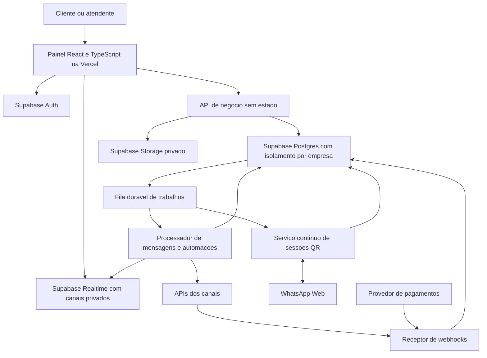

# Plano de desenvolvimento do SaaS de atendimento

Data de referência: 8 de outubro de 2026. Base analisada: Whaticket Community, commit `3daa7f3`.

O objetivo é transformar este projeto em um SaaS para várias empresas, com recursos equivalentes aos recursos comerciais publicamente documentados do Whaticket. A arquitetura proposta usa Vercel e Supabase, preservando um serviço contínuo para sessões de WhatsApp por QR e trabalhos em segundo plano. O primeiro marco comercial é atender empresas isoladas, cobrar assinaturas e operar conversas reais com segurança e recuperação de falhas.

Este plano define o escopo completo. A fundação multiempresa foi implementada e está descrita em [Execução SaaS](EXECUCAO-SAAS.md); os demais módulos continuam em desenvolvimento futuro. A equivalência deve ser validada por comportamento e critérios de aceite; o catálogo público não revela todas as regras internas do produto comercial. A implementação tem identidade própria e aproveita o código sob licença MIT deste repositório.

## Produto comercial de referência

A [página de planos](https://whaticket.com/pt/precos/) apresenta uma assinatura configurável por usuários e conexões, com recursos de atendimento, canais, automação, relatórios e integrações. IA requer consumo externo; campanhas também têm condições de cobrança. Suporte 24 horas é uma operação de serviço, e aplicativos móveis são produtos adicionais que precisam de desenvolvimento e publicação.

O inventário abaixo separa o que o código atual oferece do trabalho proposto. “Existente” indica presença no código, não validação completa de produção.

| Recurso de referência | Situação no Community | Entrega proposta |
| --- | --- | --- |
| Atendimento multiagente, departamentos e histórico | Existente para uma operação | Isolar empresas, controlar acesso e impedir atribuições concorrentes |
| Contatos e campos personalizados | Existente, estrutura simples | Tipos de campos, importação, pesquisa e deduplicação |
| Etiquetas | Ausente | Aplicar a contatos e conversas, pesquisar e segmentar |
| Perfis e supervisão | Parcial | Papéis por empresa, escopos por equipe e trilha de auditoria |
| Chat interno | Ausente | Conversas entre funcionários, grupos e notificações |
| WhatsApp QR | Existente, dois providers | Isolar credenciais, manter sessões e recuperar conexões |
| WhatsApp API e coexistência | Ausente | Provider oficial, onboarding, webhooks e modelos de mensagem |
| Instagram e Facebook | Ausente | Conectores com autorização e eventos normalizados |
| TikTok e Telegram | Ausente | Adapters próprios e validação de elegibilidade por plataforma |
| Web chat | Ausente | Widget, chat hospedado e credenciais limitadas por visitante |
| Chatbot por regras | Parcial, seleção de filas e saudações | Editor visual, versões publicadas e execução persistente |
| IA e sugestões de resposta | Ausente | Base de conhecimento, recuperação de contexto e transferência humana |
| Respostas rápidas e saudações | Existente | Escopos, variáveis e regras por canal |
| Atribuição automática | Parcial, fluxo de tickets | Distribuição por disponibilidade, carga e capacidade |
| Campanhas | Ausente | Segmentação, agendamento, processamento e acompanhamento |
| Métricas por agente e departamento, tempos e CSAT | Dashboard básico | Eventos históricos e consultas agregadas consistentes |
| Integrações e API | API simples de envio | Tokens limitados, API versionada, webhooks e conectores |
| Android e iOS | Ausente | Aplicativos com sessão, notificações e publicação nas lojas |

As [integrações comerciais](https://whaticket.com/pt/integraciones/) incluem ferramentas de automação, formulários, mensageria, vendas e Google. A implementação será rastreada individualmente: n8n, Make, Zapier, Typeform, Tally, Gmail, Calendar, Sheets, Gemini, Slack, Twilio, Telegram, Shopify e Mercado Livre. Integração via fluxo externo e integração nativa terão critérios distintos; uma página com logotipos não caracteriza um conector entregue.

Os [modelos de mensagem](https://help.whaticket.com/pt/articles/22567-como-criar-modelos-de-mensagens-no-whaticket) precisam de ciclo de submissão e acompanhamento de aprovação. As [campanhas](https://help.whaticket.com/pt/articles/25217-como-configurar-o-roteamento-e-os-contatos-para) também configuram contatos e roteamento das conversas, além do conteúdo enviado.

## Diagnóstico do repositório

| Evidência no código | Implicação | Prioridade |
| --- | --- | --- |
| Modelos e consultas não possuem organização ou associação de membros | Instalação atual não separa clientes de um SaaS | P0 |
| `UserController.store` aceita `profile` no cadastro e `CreateUserService` assume `admin`; seed habilita cadastro | Cadastro aberto requer redesenho de autorização e onboarding | P0 |
| `ShowTicketService` busca apenas por ID; leitura de mensagens usa essa busca | Faltam verificações de acesso ao objeto e à equipe nesse caminho | P0 |
| Socket.IO valida JWT, mas aceita salas por ID e usa salas globais | Eventos precisam de autorização e escopo por empresa | P0 |
| `app.ts` publica `/public` e upload salva arquivos no disco | Anexos precisam de storage privado e URLs temporárias | P0 |
| Configuração padrão é MySQL; Sequelize 5 e migrações antigas | Migração para Postgres exige validação de tipos, consultas e dados | P0 |
| Token de API vem de uma configuração global | Criar credenciais por empresa, escopos e revogação | P0 |
| Providers mantêm sessões e estado local | Separar execução contínua, persistência e propriedade de sessão | P1 |
| Dashboard calcula séries no frontend e incrementa estado anterior | Refazer métricas a partir de eventos e agregações no servidor | P1 |
| Testes encontrados se concentram em serviços de usuários | Ampliar cobertura para isolamento, mensagens, pagamentos e recuperação | P0 |
| React 16, Material UI 4 e dependências antigas | Modernização gradual com verificações de regressão | P1 |

Auditoria com `npm audit --omit=dev`: backend com 24 vulnerabilidades reportadas, sendo 2 baixas, 2 moderadas, 18 altas e 2 críticas. Pacotes críticos: `mysql2` e `sequelize`. Isso é um resultado do catálogo de advisories, não prova de exploração do sistema. A correção exige examinar cadeias de dependência e testar atualizações; não aplicar atualização forçada indiscriminadamente.

O ambiente local tem MariaDB em Docker, frontend na porta 3002 e backend na 8080. Builds e chamadas de login/API foram verificados durante a instalação. Integração real com WhatsApp, migração para Supabase e funcionamento de todos os fluxos não foram validados. Não executar a suíte atual contra o banco de uso: os scripts de teste incluem reversão de migrações.

## Arquitetura proposta

Vercel hospedará o painel Vite; Next.js não é requisito para este produto. A modernização usará TypeScript e componentes atuais, por módulo, mantendo os fluxos essenciais disponíveis. Rotas curtas de negócio podem funcionar em Vercel Functions. Supabase cuidará de identidade, Postgres, arquivos e distribuição de eventos.

Um serviço contínuo separado executará sessões QR, consumo de filas, automações e processamento de arquivos. Inicialmente pode ser um container em um host gerenciado; a contratação será definida com orçamento e volume. A recomendação decorre do estado persistente dos providers e das necessidades de processamento, não de uma proibição geral de WebSockets na Vercel.

A [documentação atual da Vercel](https://vercel.com/kb/guide/do-vercel-serverless-functions-support-websocket-connections) informa suporte a WebSockets em beta, com duração limitada e necessidade de reconexão e estado compartilhado. As [Edge Functions do Supabase](https://supabase.com/docs/guides/functions/limits) também têm limites de execução. Nenhuma sessão QR deverá depender da permanência de uma instância de função.

Usar a Cloud API como caminho comercial prioritário e oferecer QR como modalidade opcional, isolada em serviço próprio. Se QR deixar de ser requisito, a arquitetura poderá reduzir a necessidade de processos de sessão, mantendo processamento durável de trabalhos.

## Modelo de dados e isolamento

Os grupos abaixo são uma proposta de domínio; tipos e DDL serão definidos e verificados na etapa de migração.

| Domínio | Entidades previstas | Regra principal |
| --- | --- | --- |
| Identidade | organizations, profiles, memberships, invitations, roles, permissions | Usuário pode participar de empresas com papéis diferentes |
| Atendimento | teams, team_members, channels, contacts, contact_identities, conversations, assignments | Referências entre entidades devem pertencer à mesma empresa |
| Mensagens | messages, attachments, message_events, conversation_events | IDs externos únicos por canal; eventos preservam histórico |
| Organização | tags, contact_tags, conversation_tags, custom_field_definitions, custom_field_values, internal_notes | Campos tipados e informações internas não chegam ao cliente |
| Automação | business_hours, holidays, automation_flows, flow_versions, flow_runs | Execução usa uma versão publicada e pode ser retomada |
| Campanhas | campaigns, audiences, campaign_recipients, consent_records, opt_outs | Destinatário e tentativa rastreáveis; descadastro respeitado |
| IA | knowledge_sources, documents, document_chunks, ai_runs, usage_events | Contexto e consumo isolados por empresa |
| Comercial | plans, plan_entitlements, subscriptions, billing_events, usage_counters | Limites verificados no servidor e eventos de pagamento idempotentes |
| Infraestrutura | inbound_events, outbox_events, jobs, job_attempts, integration_credentials, webhook_deliveries, audit_events | Segredos restritos e falhas recuperáveis |
| Colaboração | internal_threads, thread_members, internal_messages, notifications | Apenas participantes autorizados acessam o conteúdo |

Todos os registros de negócio deverão carregar `organization_id`. Associações terão restrições que impeçam misturar empresas. Identidades dos canais serão separadas do contato para permitir unificação sem confundir um identificador do WhatsApp com um do Instagram.

Implementar [RLS](https://supabase.com/docs/guides/database/postgres/row-level-security) conforme associação e papel, com controle adicional por equipe/conversa. Não confiar em `organization_id` enviado pelo navegador nem em metadata editável do usuário. Operações normais usarão a identidade autenticada; workers privilegiados terão escopo explícito e testes próprios, porque credenciais privilegiadas podem contornar RLS.

Aplicar o mesmo isolamento a [canais privados do Realtime](https://supabase.com/docs/guides/realtime/authorization), Storage, exportações, pesquisa e agregações. Chaves secretas nunca chegam ao frontend. Tokens de integrações ficam criptografados, com rotação e acesso limitado.

A [mudança de exposição da Data API](https://supabase.com/changelog/45329-breaking-change-tables-not-exposed-to-data-and-graphql-api-automatically) exige verificar grants além das políticas. Migrações deverão explicitar acesso, RLS, índices de relações e consultas principais. Relatórios usarão UTC para persistência e fuso da empresa para apresentação. A atualização de [Postgres 15.19 e 17.11](https://supabase.com/changelog/postgres-15-19-17-11-breaking-changes) deverá ser considerada conforme a versão e extensões do projeto escolhido.

## Etapas e critérios de aceite

As etapas têm dependências, mas integrações específicas podem avançar após a fundação. Toda entrega terá interface, persistência, autorização e testes apropriados.

| Etapa | Entregas | Critério de aceite |
| --- | --- | --- |
| 0 Fundamento técnico | Runtime suportado, lockfiles versionados, auditoria de dependências, ambiente reproduzível, CI e testes em banco separado | Build repetível; principais fluxos preservados; vulnerabilidades críticas resolvidas ou dependência removida |
| 1 Fundação SaaS | Supabase local, Postgres, Auth, organizações, membros, convites, papéis, RLS, Storage e migração dos dados existentes | Empresa A não acessa dados, arquivos ou eventos de B; cadastro não permite escolher privilégio; restauração validada |
| 2 Motor de mensagens | Providers por canal, inbox/outbox, fila durável, tentativas, eventos de entrega, recuperação e serviço QR | Webhook repetido não duplica mensagem; queda do worker não perde trabalho; reenvio ambíguo é reconciliado quando o provider permite |
| 3 Atendimento profissional | Inbox unificada, etiquetas, notas internas, pesquisa, equipes, horários, atribuição e supervisão | Dois agentes não assumem o mesmo ticket simultaneamente; permissões são respeitadas; fora do horário segue regra da empresa |
| 4 Comercialização | Painéis de dono da plataforma e administrador da empresa, planos, cotas, trial, assinatura, faturas e medição | Pagamento duplicado não duplica crédito; mudança de plano atualiza direitos; limites funcionam mesmo em requisições concorrentes |
| 5 API oficial e canais | Cloud API, modelos, coexistência quando elegível, Telegram, web chat, Instagram, Facebook e TikTok | Receber e responder em cada canal com credenciais reais; eventos e anexos normalizados; permissões e renovação tratadas |
| 6 Chatbot e campanhas | Editor de fluxos, condições, variáveis, transferência, versões, segmentos, importação e agendamento | Fluxo retoma após reinício; campanha pausa/cancela; fuso e destinatários estão corretos; falhas não geram envio cego repetido |
| 7 Inteligência artificial | Conhecimento por empresa, busca contextual, respostas sugeridas, resumo e bot com transferência | Avaliação com perguntas conhecidas e sem resposta; zero contexto entre empresas; limites de custo e transferência funcionam |
| 8 Métricas e colaboração | Tempos de atendimento, métricas por equipe/agente, CSAT, exportação e chat interno | Resultados conferem com eventos de teste incluindo reaberturas e transferências; chat interno respeita participantes |
| 9 Ecossistema | API versionada, tokens com escopos, webhooks assinados, receitas de automação e conectores individualizados | Uma automação real por integração; revogação, repetição, quota e falha externas cobertas |
| 10 Mobile e operação | Android/iOS, push, observabilidade, backup, restauração, capacidade, suporte e implantação gradual | Sessão e notificações reais; publicação validada; recuperação documentada; alertas chegam à operação |

Primeira versão vendável: etapas 0 a 4, Cloud API da etapa 5 e testes operacionais essenciais. Os recursos ainda indisponíveis terão estado claro no produto e na oferta. A versão com equivalência ampla só será declarada depois de completar o inventário e validar os conectores necessários.

### Primeiras entregas concretas

1. Fixar runtime e gerenciador, versionar lockfiles e criar pipeline de build e testes sem utilizar o banco local de operação.
2. Criar testes que reproduzam os problemas de autorização de tickets, cadastro e salas de eventos; corrigir os caminhos atuais que continuarem ativos.
3. Inicializar um Supabase local exclusivo deste projeto. Containers de outros projetos existentes na máquina não serão reutilizados como destino de migração.
4. Implementar empresa, associação de usuários, convite e papéis, com testes usando duas empresas e usuários de diferentes equipes.
5. Migrar contatos, filas, tickets e mensagens para Postgres com mapeamento de IDs, preservação de anexos e reconciliação de contagens.
6. Integrar a inbox existente à nova identidade, dados e eventos. Liberar módulos seguintes apenas após passar pelo isolamento ponta a ponta.

## Regras de implementação dos módulos

Mensagens: persistir recepção antes de responder sucesso ao webhook. Enviar por outbox com deduplicação, ordenação por conversa quando necessária, tratamento de limites e fila de falhas. Não prometer envio exatamente uma vez quando a plataforma não oferecer idempotência ou consulta que permita reconciliação após timeout.

Campanhas: snapshot de destinatários, preview, evidência de consentimento, descadastro, limites por conexão, janela de envio e relógio por fuso. A política e o uso de modelos serão validados na documentação de cada canal durante a implementação. Crédito da nossa assinatura, tarifa da plataforma e custo de infraestrutura serão contabilizados separadamente.

IA: recuperar apenas documentos da empresa, limitar acesso a ferramentas, impedir que instruções de mensagens ou documentos concedam permissões, registrar versão do prompt e modelo, limitar orçamento e manter transferência humana. Seleção de provedor/modelo e SDK será feita com documentação atual na implementação. Consumo não é gratuito por fazer parte da tela do produto.

Cobrança: escolher provedor conforme moeda, meios de pagamento e disponibilidade na conta. A assinatura terá estado local consistente com os eventos do provedor. Definir grace period, cancelamento, reativação, downgrade e bloqueios sem apagar histórico. Quantidades e quotas ficarão em planos configuráveis, evitando replicar preços de outro produto.

Integrações: verificar elegibilidade, scopes, assinatura de webhooks, renovação de credenciais e limites de cada plataforma. API externa terá documentação OpenAPI, credenciais revogáveis e erros estáveis. Para TikTok e coexistência, concluir prova de integração antes de prometer disponibilidade comercial.

Mobile: PWA pode ser uma entrega intermediária; não será contabilizada como equivalência aos aplicativos nativos. React Native é uma proposta para compartilhar tipos e contratos, com validação de notificações, anexos e áudio em aparelhos reais.

## Validação e entrada em produção

| Área | Verificação obrigatória |
| --- | --- |
| Isolamento | REST, RLS, Realtime, URLs de arquivos, exports, relatórios, busca e IA com duas empresas |
| Permissões | Dono, administrador, supervisor e atendente; membro removido; convite expirado; token revogado |
| Mensagens | Eventos repetidos e fora de ordem, quedas, limites, anexos e timeout de envio |
| Automação | Reinício no meio do fluxo, transferência humana, agendamento e cancelamento concorrente |
| Pagamento | Eventos repetidos e fora de ordem, pagamento falho, renovação, upgrade e downgrade |
| Métricas | Relógio controlado, reabertura, mudança de responsável e horário útil |
| Operação | Restore em ambiente isolado, rollback, logs sem segredos e alertas de fila/conexão |
| Interface | Login, convite, primeiro canal, receber/responder/transferir/fechar e uso em celular |

Metas iniciais propostas para carga: 10 empresas de teste, 100 agentes simultâneos e 10 eventos de mensagem por segundo, com p95 inferior a 500 ms para consultas usuais de inbox e menos de 3 segundos entre persistência e atualização do painel. São metas para benchmark em staging, sem incluir latência do canal; não são capacidade já comprovada ou promessa comercial.

Ambientes separados: desenvolvimento local, staging e produção. Migrações usam mudanças compatíveis com a versão anterior sempre que possível, flags por recurso e reconciliação antes da troca definitiva. Fazer backup antes de migrar; manter caminho de retorno sem escrita simultânea descontrolada em dois bancos.

## Prazo e custos de planejamento

Estimativa preliminar, sujeita aos resultados da fundação e aos acessos externos: 8 a 12 sprints de duas semanas para a primeira versão comercial, com equipe de dois desenvolvedores fullstack e QA parcial. Equivalência ampla: 20 a 32 sprints totais, incluindo integrações e mobile. Uma única pessoa tende a precisar de mais tempo. Estes intervalos são hipóteses de planejamento, não compromisso de entrega nem previsão da duração de uma sessão de agente.

As estimativas deverão ser recalculadas ao finalizar a etapa 1, quando isolamento, migração e motor de atendimento tiverem esforço conhecido. Aprovações de plataformas e publicação nas lojas podem acrescentar tempo fora do controle do desenvolvimento.

Custos recorrentes: Vercel, Supabase, host do worker, armazenamento/tráfego, tarifas de canais, uso de IA, pagamentos, e-mail transacional, monitoramento e equipe de suporte. Dimensionar usando número de empresas, agentes ativos, mensagens por dia, tamanho/retencão de arquivos e intensidade da IA. Não usar a ideia de histórico ilimitado como promessa de custo ou armazenamento infinito.

## Dependências externas

O desenvolvimento local e os contratos de integração podem avançar agora. A validação e publicação dos serviços dependerão de projetos e acesso em Supabase/Vercel, domínio, contas dos canais, provedor de pagamentos e credenciais de IA. Para cada conector, diferenciar teste com mocks, teste em sandbox e operação com conta real.

O SaaS também precisa de uma identidade comercial, política de retenção/exportação/exclusão de dados, canal de suporte, monitoramento e responsabilidade por incidentes. Suporte 24 horas exige pessoas ou serviço contratado; software por si só não entrega esse compromisso.

As decisões já confirmadas são vender para várias empresas e usar Supabase/Vercel. Até surgir uma restrição adicional, o plano assume isolamento desde a fundação, prioridade para Cloud API, QR opcional e cobrança por planos configuráveis. A seleção definitiva de provedores e quotas será feita quando cada integração tiver implementação concreta e custos verificáveis.
